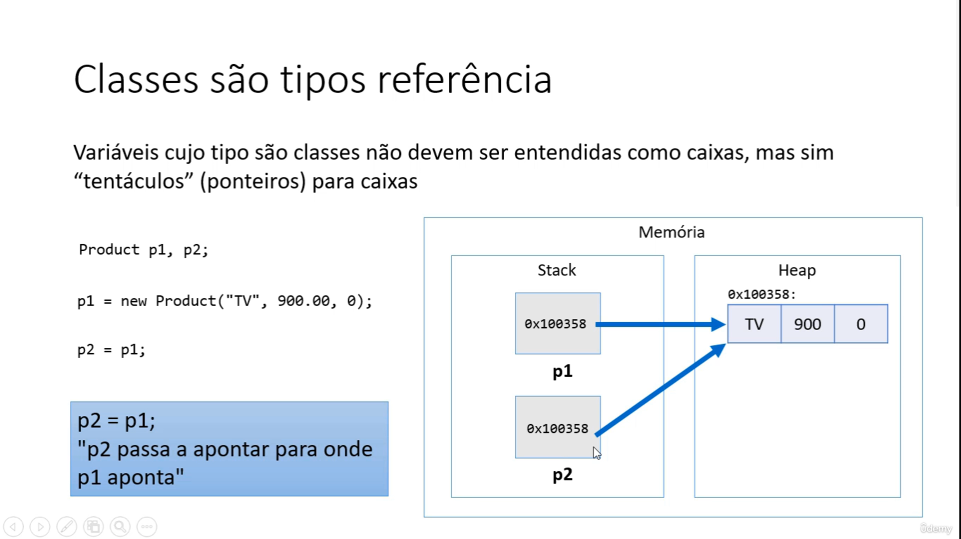
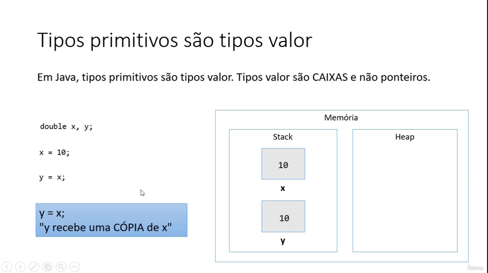

# JAVA

## Types of **variables**

- **String**: "Hello", "Say my name", "Some text".
- **int**: 123, -123, 657, 2345, 10, 0.
- **float**: 19.34, 5.678, 3.14, -9.45.
- **char**: "a", "B", "y".
- **boolean**: true or false

## Declaring variables
> you must ***specify*** the type and assign it a value
```java
type variableName  = value;

// Example

String surname = "Madruga";
int myAge = 22;
myAge = 26; // reassigning the value of the variable.
System.out.println("Pedro " + surname + " have " + myAge + " years.");
// Will print ("Pedro Madruga have 26 years.")
--
public class Learn {
			public static void main(String[] args) {

				String car = "Lamborghini";
				final int doors = 2; // works as a constant
				
				System.out.println(car + " have " + doors + " doors");
			}
		}
```


### Other variable's types
```java

	int myNum = 5;
	float myFloatNum = 5.99;
	char myLetter = 'D';
	boolean myBool = true;
	String myText = "Hello";

```

## The general rules for naming variables are:

- Names can contain letters, digits, underscores, and dollar signs
- Names must **begin** with a **letter**
- Names should **start** with a **lowercase letter**, and **cannot contain whitespace**
- Names can also begin with **$** and **_**
- Names are case-sensitive (**"myVar" and "myvar" are different variables**)
- **Reserved words** (like Java keywords, **such as int or boolean**) **cannot** be **used** **as names**	

## Java Data Types
```java
	int myNum = 5;               // Integer (whole number)
	float myFloatNum = 5.99f;    // Floating point number
	har myLetter = 'D';          // Character
	boolean myBool = true;       // Boolean
	String myText = "Hello";     // String
```
> Data types are divided into **two groups**: 
- **Primitive** data types - includes ***byte***, ***short***, ***int***, ***long***, ***float***, ***double***,***boolean*** and ***char***
- **Non-primitive** data types - such as ***String***, ***Arrays*** and ***Classes***

| Data Type      | Size           | 
| -------------- | -------------- | 
| byte           | 1 byte         | 
| short          | 2 bytes        |
| long           | 8 bytes        | 
| float          | 4 bytes        | 
| double         | 8 bytes        | 
| boolean        | 1 byte         | 
| char           | 2 bytes        | 
| int            | 4 bytes        | 


## Declaracao de variaveis
```java
<tipo> <nome> = <valor inicial>

int idade = 25;
double altura = 1.68;
char sexo = 'F';


System.out.printf("%.2f%n", x);
// para limitar a duas casas decimais (%.qttdf%n)
```

## para concatenar varios elementos em um mesmo comando de escrita

- **%f** -> ponto flutuante
- **%d** -> inteiro
- **%s** -> texto
- **%n** -> quebra de linha
```java

String nome = "Pedro";
int idade = 31;
double renda = 4000.0;
System.out.printf("%s tem %d anos e ganha R$ %.2f reais%n", nome, idade, renda);

```

## CASTING -> conversao explicita dos valores
 
 - **Sempre** indique o **tipo de numero**, se a **expressao** **for de ponto flutuante**(nao inteira)
 - abaixo, **indica uma boa pratica**, nao e obrigatorio utilizar, mas e bom (pode dar problema em alguns casos)

 - Para **DOUBLE** use: **.0**
 ```java
double h, b, B, area;

		 b = 6.0;
		 B = 8.0;
		 h = 5.0;
		 area = (b + B) / 2.0 * h;

		System.out.println("Area do trapezio: " + area + "m2");
 ```
 
 - Para **FLOAT** use: **f**;
 ```java
float h, b, B, area;

		 b = 6f;
		 B = 8f;
		 h = 5f;
		 area = (b + B) / 2f * h;

		System.out.println("Area do trapezio: " + area + "m2");
 ```

## ENTRADA DE DADOS PT.1

- Para fazer entrada de dados, vamos criar um objeto do tipo "Scanner" da seguinte forma:
```java

	// Variavel do tipo Scanner
	Scanner sc = new Scanner(System.in);

```
- para isso, preciso colocar no topo da minha clasee o seguinte IMPORT
```java
import java.util.Scanner;

public class NA_course {
	public static void main(String[] args) {
		... }
```
- faca 
```java 
sc.close()
// .close() funcao que vai desalocar essa funcao que nos criamos
```
- quando nao precisar mais do objeto 'sc'

# Entrada de dados e tipos de leitura

1. ler uma **palavra** a **partir do teclado**
```java
	Scanner sc = new Scanner(System.in);

	String x;
	x = sc.next();
	System.out.println("Voce digitou: " + x);
```
2. ler um **numero** a partir do teclado
```java
	Scanner newNumber = new Scanner(System.in);
	
	int y;
	y = newNumber.nextInt();
	System.out.println("Numero que foi digitado: " + y);
```
3. ler um **numero com ponto flutuante**
```java
	Scanner numberDouble = new Scanner(System.in);

	double z;
	z = numberDouble.nextDouble();
	System.out.println("Numero que foi digitado: " + z);
```
4. ler um **caractere**
```java
	Scanner name = new Scanner(System.in);

	char name;
	name = name.next().charAt(0);
	System.out.println("Caractere que foi digitado: " + name);
```
5. ler **varios dados na mesma linha**
```java
	String x;
	int y;
	double z;
		
	x = sc.next();
	y = sc.nextInt();
	z = sc.nextDouble();
		
	System.out.println("Dados digitados:");
	System.out.println(x);
	System.out.println(y);
	System.out.println(z);
```
# Entrada de dados PT.2

## Para ler um texto ATE A QUEBRA DE LINHA
```java
import java.util.Scanner;

public class NA_course {
	public static void main(String[] args) {

		Scanner sc = new Scanner(System.in);

		String s1, s2, s3;

		s1 = sc.nextLine();
		s2 = sc.nextLine();
		s3 = sc.nextLine();

		System.out.println("Dados digitados:");
		System.out.println(s1);
		System.out.println(s2);
		System.out.println(s3);

	}
}
```
## ATENCAO: quebra de linha pendente
```java
import java.util.Scanner;

public class NA_course {
	public static void main(String[] args) {

		Scanner sc = new Scanner(System.in);

		int x;
		String s1, s2, s3;

		x = sc.nextInt();
		s1 = sc.nextLine();
		s2 = sc.nextLine();
		s3 = sc.nextLine();

		System.out.println("Dados digitados:");
		System.out.println(x);
		System.out.println(s1);
		System.out.println(s2);
		System.out.println(s3);

		// OBS: Quando voce usa um comando de leitura diferente do nextLine() e da alguma quebra de linha, essa quebra de linha fica "pendente" na entrada padrao.
		
		// Se voce entao fizer um nextLIne(), aquela quebra de linha pendente sera absorvida pelo nextLine()
		// SOLUCAO: Faca um nextLine() extra antes de fazer o nextLine() de seu interesse
	}
}
```
# RESUMO
1. Scanner
   - next()
   - nextInt()
   - nextDouble()
   - next().charAt(0)
2. Locale
3. Como ler ate a quebra de linha
   - nextLine()
   - como limpar o buffer de leitura

# Functions em JAVA

| Exemplo           | Significado                         |
| --------------    | --------------                      |
|A = Math.sqrt(x);  | A recebe raiz quadrada de X         |
|A = Math.pow(x,y); | A recebe o resultado de X elevado a Y|
|A = Math.abs(x);   | A recebe o valor absoluto de X      |

```java
public class NA_course {
	public static void main(String[] args) {


		double x = 3.0;
		double y = 4.0;
		double z = -5.0;
		double A, B, C;

		A = Math.sqrt(x);
		B = Math.sqrt(y);
		C = Math.sqrt(25.0);
		System.out.println("A raiz quadrada de " + x + " = " + A);	
		System.out.println("A raiz quadrada de " + y + " = " + B);
		System.out.println("A raiz quadrada de 25 " + " = " + C);

		A = Math.pow(x, y);
		B = Math.pow(x, 2.0);
		C = Math.pow(5.0, 2.0);
		System.out.println(x + " elevado a " + y + " = " + A);
		System.out.println(x + " elevado ao quadrado = " + B);
		System.out.println("5.0 elevado ao quadrado = " + C);

		A = Math.abs(y);
		B = Math.abs(z);
		System.out.println("Valor absoluto de " + y + " = " + A);
		System.out.println("Valor absoluto de " + z + " = " + B);

	}
}
```
- **sqrt** : raiz quadrada.
- **pow** : potenciacao.
- **abs** : valor absoluto.
  

# Operadores de atribuicao cumulativa
- a += b; | a = a + b;
- a -= b; | a = a - b;
- a *= b; | a = a * b;
- a /= b; | a = a / b;
- a %= b; | a = a % b;

```java
		Scanner sc = new Scanner(System.in);

		System.out.print("Total de minutos gastos: ");
		int minutos = sc.nextInt();
		double conta = 50.0;

		if(minutos > 100) {
			conta += (minutos - 100) * 2.0;
		}

		System.out.printf("Valor da conta = R$ %.2f%n", conta);

		sc.close();

```

# SWITCH/CASE VS IF/ELSE
> Nao existe um melhor do que o outro, tudo vai depender de qual sera a finalidade do programa.

```java
Scanner sc = new Scanner(System.in);

		int x = sc.nextInt();
		String dia;

		switch(x) {
		case 1:
			dia = "domingo";
			break;
		case 2:
			dia = "segunda";
			break;
		case 3: 
			dia = "terca";
			break;
		case 4:
			dia = "quarta";
			break;
		case 5:
			dia = "quinta";
			break;
		case 6:
			dia = "sexta";
			break;
		case 7:
			dia = "sabado";
			break;
		default:
			dia = "valor invalido";
			break;
		}

		System.out.print("Dia da semana: " + dia);

		sc.close();
```

```java
        Scanner sc = new Scanner(System.in);

        int x = sc.nextInt();
        String dia;

        if (x == 1) {
            dia = "domingo";
        } else if (x == 2) {
            dia = "segunda";
        } else if (x == 3) {
            dia = "terca";
        } else if (x == 4) {
            dia = "quarta";
        } else if (x == 5) {
            dia = "quinta";
        } else if (x == 6) {
            dia = "sexta";
        } else if (x == 7) {
            dia = "sabado";
        } else {
            dia = "valor invalido";
        }

        System.out.print("Dia da semana: " + dia);

        sc.close();
```

# Expressao condicional ternaria
> Estrutura opcional ao if-else **quando se deseja decidir um VALOR com base em uma condition**

## Sintaxe
( condition ) ? valor_se_verdadeiro : valor_se_falso

### Exemplos
```java
( 2 > 4 ) ? "Sim" : "Nao" -> nao
( 10 != 3 ) ? "Pedro" : "Madruga" -> Pedro


// EX 2
double preco = 34;
double desconto;
if (preco < 20.0) {
	desconto = preco * 0.1;
} else {
	desconto = preco * 0.05;
}

// COM O OPERADOR TERNARIO
double preco = 34;
double desconto = (preco < 20.0) ? preco * 0.1 : preco * 0.05;
```
# Functions interessantes para String

- **Formatar**: toLowerCase(), toUpperCase(), trim()
- **Recortar**: substring(inicio), substring(inicio, fim)
- **Substituir**: Replace(char, char), Replace(string, string)
- **Buscar**: IndexOf, LastIndexOf
- str.Split("") -> recortar a string em um separador que que for colocado.
```java
String original = "abcde FGHIJ ABC abc DEFG";

		String s01 = original.toLowerCase();
		String s02 = original.toUpperCase();
		String s03 = original.trim();
		String s04 = original.substring(2);
		String s05 = original.substring(2, 9);
		String s06 = original.replace('a', 'x');
		String s07 = original.replace("abc", "xy");
		int i = original.indexOf("bc");
		int j = original.lastIndexOf("bc");


		System.out.println("Original: " + original);
		System.out.println("ToLowerCase: " + s01);
		System.out.println("ToUpperCase: " + s02);
		System.out.println("trim: " + s03);
		System.out.println("substring(2): " + s04);
		System.out.println("substring(2, 9): " + s05);
		System.out.println("replace('a', 'x'): " + s06);
		System.out.println("replace('abc', 'xy'): " + s07);
		System.out.println("Index of 'bc': " + i);
		System.out.println("Last index of 'bc': " + j);

		String s = "potato apple lemon orange banana";

		String[] vect = s.split(" ");
		System.out.println(vect[0]);
		System.out.println(vect[1]);
		System.out.println(vect[2]);
		System.out.println(vect[3]);
		System.out.println(vect[4]);
```

# FUNCOES
- **Functions** em **classe** recebem o nome de "**metodos**"
```java
package test;

import java.util.Scanner;

public class Test {
	public static void main(String[] args) {
	// My app default function -> my app entry point
		Scanner sc = new Scanner(System.in);
		
		System.out.println("Enter three numbers: ");
		int a = sc.nextInt();
		int b = sc.nextInt();
		int c = sc.nextInt();
		
		int higher = max(a, b, c);
		
		showResult(higher);
		
		sc.close();
	}
	
	public static int max(int a, int b, int c) {
		int aux; // variavel local dessa funcao
		if(a > b && a > c) {
			aux = a;
		} else if(b > c) {
			aux = b;
		} else {
			aux = c;
		}
		
		return aux;
	}
	// public -> para que essa funcao fique disponivel para outras classes
	// static -> para que a funcao possa ser chamada independente de criar um objeto
	// int -> o tipo de variavel que vai retornar a funcao
	// max() -> o nome da funcao 
	// int a, int b, int c -> sao os parametros funcao, que nao precisam ter o mesmo nome das variaveis do programa principal 
	
	public static void showResult(int value) {
		System.out.println("Higher = " + value);
	}
	// void -> quando a funcao faz uma acao sem retornar um valor para ser reaproveitado no programa

}
```
- O nome do **parametro** **nao precisa ser igual** ao **nome da variavel do programa principal** 
- Quando eu chamar a function, os valores dos parametros vao casar e se tornarao um so 

# IPC
	 > Quais são os benefícios de se calcular a area de um triangulo por meio de um MÉTODO dentro da CLASSE Triangle?
	 1. Reaproveitamento de código: nós eliminamos o codigo repetido(calculo das areas dos triangulos x e y) no programa principal.
	 2. Delegação de responsabilidade: quem deve ser responsavel por saber como calcular a area de um triangulo é p proprio triangulo. A logica do calculo da area nao deve estar em outro lugar.
  
## Codigos
> class **Triangle** que contém o método
```java
package packages.entities;
import java.util.Scanner;

public class Triangle{
  Scanner sc = new Scanner(System.in);

  // atributos
  public double a;
  public double b;
  public double c;

  public double area() {
      double p = (a + b + c) / 2.0;
      double result = Math.sqrt(p * (p - a) * (p - b) * (p - c));
      return result;
  }
}
```
> public class Program
```java
import java.util.Locale;
import java.util.Scanner;

import packages.entities.Triangle;

public class Program {
  public static void main(String[] args) {
    Locale.setDefault(Locale.US);
    Scanner sc = new Scanner(System.in);
    
    Triangle x, y;
    x = new Triangle();
    y = new Triangle();

    System.out.println("Enter the measures of triangle X: ");
    x.a = sc.nextDouble();
    x.b = sc.nextDouble();
    x.c = sc.nextDouble();
    System.out.println("Enter the measures of triangle Y: ");
    y.a = sc.nextDouble();
    y.b = sc.nextDouble();
    y.c = sc.nextDouble();

    double areaX = x.area();
    double areaY = y.area();
    
    System.out.printf("Triangle X area: %.4f%n", areaX);
    System.out.printf("Triangle Y area: %.4f%n", areaY);
    
    if (areaX > areaY) {
      System.out.println("Larger area: X");
    } else {
      System.out.println("Larger area: Y");
    }
	}

}
```
## Codigo de uma classe Program
> class **Product** que chama os métodos e os objetos

 ```java
package packages;

import packages.JAVA.Estoque;

import java.util.Locale;
import java.util.Scanner;

public class Product {
   public static void main(String[] args) {
      Scanner sc = new Scanner(System.in);
      Locale.setDefault(Locale.US);

      // Constructed object called "stock"
      Estoque stock = new Estoque();

      // Set values to objects "name", "price", "quantity"
      System.out.println("Enter product data");
      System.out.print("Name: ");
      stock.name = sc.nextLine();
      System.out.print("Price: ");
      stock.price = sc.nextDouble();
      System.out.print("Quantity: ");
      stock.quantity = sc.nextInt();

      // Updated data with method "totalValueInStock" which return (price * quantity).
      System.out.println("Product data: " + stock.name + ", $ " + stock.price + ", " + stock.quantity + " units , $ " + stock.totalValueInStock());

      // Adding data to stock with method addProducts which receive parameter an integer value (this.quantity += quantity);
      System.out.println("Enter the number of products to be added in stock: ");
      // I declared the parameter "quantity"
      int quantity = sc.nextInt();
      stock.addProducts(quantity);
      System.out.println("Updated data: " + stock);

      // Removing data from stock with method removeProducts which receive parameter an integer value (this.quantity -= quantity);
      System.out.println("Enter the number of products to be removed from stock: ");
      quantity = sc.nextInt();
      stock.removeProducts(quantity);

      // Declaring the final updated data with the method which will format to String
      System.out.println("Updated data: " + stock.toString());

      sc.close();

   }
}
```
> class **Estoque** que contém os *métodos* e *objetos* 
```java
package packages;

public class Estoque {
    public String name;
    public double price;
    public int quantity;


    public double totalValueInStock() {
        return price * quantity;
    }

    public void addProducts(int quantity) {
        this.quantity += quantity;
    }

    public void removeProducts(int quantity) {
        this.quantity -= quantity;
    }

    public String toString() {
        return name
                + ", $ "
                + String.format("%.2f", price)
                + ", "
                + quantity
                + " units, Total: $ "
                + String.format("%.2f", totalValueInStock());
    }

}
```
# Membros Estáticos

- São membros que fazem sentido independentemente de objetos.
- Não precisam de objetos para serem chamados.
- São chamados a partis do próprio nome da classe.
- Também são chamados membros de classe
- Em oposição a membros de instância

## CHECKLIST
> We'll do a program that calculate a circumference's area of three distinct ways.
### 1. *Primeira versão*: métodos na **própria classe do programa**
```java
public class Program {

    public static final double PI = 3.14159;

    public static void main(String[] args) {

        Locale.setDefault(Locale.US);
        Scanner sc = new Scanner(System.in);

        System.out.print("Enter radius: ");
        double radius = sc.nextDouble();

        double c = circumference(radius);

        double v = volume(radius);

        System.out.printf("Circumference: %.2f%n", c);
        System.out.printf("Volume: %.2f%n", v);
        System.out.printf("PI: %.2f%n", PI);

        sc.close();
    }

    // se eu tirar o STATIC das funções, o programa irá quebrar. Por quê?
    // R. Não posso chamar um mét0do não-estático dentro de um mét0do estático

    public static double circumference(double radius) {
        return 2.0 * PI * radius;
    }

    public static double volume(double radius) {
        return 4.0 * PI * radius * radius * radius / 3.0;
    }

}
```

### 2. *Segunda versão*: classe Calculator com **membros de instância**
- ***Program.java***
```java
public class Program {

    public static void main(String[] args) {

        Locale.setDefault(Locale.US);
        Scanner sc = new Scanner(System.in);
        // instanciei o objeto calc
        Calculator calc = new Calculator();

        System.out.print("Enter radius: ");
        double radius = sc.nextDouble();

        double c = calc.circumference(radius);

        double v = calc.volume(radius);

        System.out.printf("Circumference: %.2f%n", c);
        System.out.printf("Volume: %.2f%n", v);
        System.out.printf("PI: %.2f%n", calc.PI);

        sc.close();
    }
}
```
- ***Calculator.java***
```java
public class Calculator {

    // SEGUNDA MANEIRA
    // chamei os métodos e classes através de um objeto

    public final double PI = 3.14159;


    public double circumference(double radius) {
        return 2.0 * PI * radius;
    }

    public double volume(double radius) {
        return 4.0 * PI * radius * radius * radius / 3.0;
    }
}
```

### 3. *Terceira versão*: classe Calculator com **método estático**
> Tenho métodos estáticos e uma constante que também é estática, **permitindo
utilizar esses métodos independente de qualquer objeto.**

- ***Program.java***
```java
public class Program {

    public static void main(String[] args) {

        Locale.setDefault(Locale.US);
        Scanner sc = new Scanner(System.in);
        // no programa principal, eu não preciso mais instanciar objeto algum, para depois chamar a operação a partir do objeto
        System.out.print("Enter radius: ");
        double radius = sc.nextDouble();

        // agora posso chamar a própria classe
        double c = Calculator.circumference(radius);

        double v = Calculator.volume(radius);

        System.out.printf("Circumference: %.2f%n", c);
        System.out.printf("Volume: %.2f%n", v);
        System.out.printf("PI: %.2f%n", Calculator.PI);

        sc.close();
    }
}
```
- ***Calculator.java***
```java
public class Calculator {

    // TERCEIRA MANEIRA

    // o PI vai ser estático, será uma constante que independe de qualquer objeto do tipo Calculator
    public static final double PI = 3.14159;

    // pode ser calculada independente de objeto
    public static double circumference(double radius) {
        return 2.0 * PI * radius;
    }

    // pode ser calculada independente de objeto
    public static double volume(double radius) {
        return 4.0 * PI * radius * radius * radius / 3.0;
    }
}
```
# Construtores, palavra this, sobrecarga, encapsulamento

## 1. Construtores
- Operação especial da classe, executada no momento da instanciação do objeto
- Usos comuns:
  - iniciar valores dos atributos
  - permitir ou obrigar que o objeto receba dados no momento de sua instanciação
- **Se um construtor customizado não for especificado, a classe disponibiliza o construtor padrão**
```java
Product p = new Product();
```
- É possível especificar mais de um construtor na mesma classe(sobrecarga)

### OBS: método **CONSTRUTOR**
```java
        // declarar um construtor
public Product(String name, double price, int quantity) {
  // this -> referenciando ao atributo do objeto
  this.name = name;
  this.price = price;
  this.quantity = quantity;
}
```
## 2. Palavra THIS
- Serve para diferenciar o atributo do objeto e o parametro do construtor   
- É uma referencia para o próprio objeto
- Usos comuns:
  - Diferenciar atributos de variáveis locais
  - Passar o próprio objeto como argumento na chamada de um método ou construtor


### Classe Program
```java

public class Program {
    public static void main(String[] args) {
        Locale.setDefault(Locale.US);
        Scanner sc = new Scanner(System.in);


        // eu declarei algumas variáveis (1, 2 e 3)
        // instanciei o method constructor e passo os objetos como parametros do construtor (4)
        System.out.println("Enter product data: ");

        // 1.
        System.out.print("Name: ");
        String name = sc.nextLine();
        // 2.
        System.out.print("Price: ");
        double price = sc.nextDouble();
        // 3.
        System.out.print("Quantity in stock: ");
        int quantity = sc.nextInt();
        // 4.
        Product product = new Product(name, price, quantity);

        System.out.println();
        System.out.println("Product data: " + product);
        System.out.println();

        System.out.print("Enter the number of products to be added in stock: ");
        quantity = sc.nextInt();
        product.addProducts(quantity);

        System.out.println();
        System.out.println("Updated data: " + product);
        System.out.println();
        System.out.print("Enter the number of products to be removed from stock: ");
        quantity = sc.nextInt();
        product.removeProducts(quantity);

        System.out.println();
        System.out.println("Updated data: " + product);
        sc.close();
    }
}

```

### Classe Product
```java

public class Product {
    public String name;
    public double price;
    public int quantity;

    // declarar um construtor
    public Product(String name, double price, int quantity) {
        this.name = name;
        this.price = price;
        this.quantity = quantity;
        // this -> referenciando ao atributo do objeto
        // this -> to acessando o name do objeto na linha 4
        // this -> to acessando o price bo objeto na linha 5
        // this -> to acessando a quantity bo objeto na linha 6
    }

    public double totalValueInStock() {
        return price * quantity;
    }

    public void addProducts(int quantity) {
        this.quantity += quantity;
    }

    public void removeProducts(int quantity) {
        this.quantity -= quantity;
    }

    public String toString() {
        return name
                + ", $ "
                + String.format("%.2f", price)
                + ", "
                + quantity
                + " units, Total: $ "
                + String.format("%.2f", totalValueInStock());
    }
}
```

## 3. Sobrecarga - disponibilizar mais de uma versão da mesma operação
- Recurso que uma classe possui de **oferecer mais de uma operação com o mesmo nome, mas com diferentes listas de parâmetros**.
> **Proposta de melhoria:** criar um construtor opcional, que recebe apenas nome e preço do produto. A quantidade em estoque deste novo produto deverá então ser iniciada com o valor 0(zero).

### Classe Program
```java
public class Program {
    public static void main(String[] args) {
        Locale.setDefault(Locale.US);
        Scanner sc = new Scanner(System.in);


        System.out.println("Enter product data: ");

        // 1.
        System.out.print("Name: ");
        String name = sc.nextLine();
        // 2.
        System.out.print("Price: ");
        double price = sc.nextDouble();
        // 4.
        Product product = new Product(name, price);

        System.out.println();
        System.out.println("Product data: " + product);
        System.out.println();

        System.out.print("Enter the number of products to be added in stock: ");
        int quantity = sc.nextInt();
        product.addProducts(quantity);

        System.out.println();
        System.out.println("Updated data: " + product);
        System.out.println();
        System.out.print("Enter the number of products to be removed from stock: ");
        quantity = sc.nextInt();
        product.removeProducts(quantity);

        System.out.println();
        System.out.println("Updated data: " + product);
        sc.close();
    }
}
```

### Classe Product
```java
public class Product {
    public String nome;
    public double preco;
    public int quantidade;

    // declarar um construtor
    public Product(String name, double price, int quantity) {
        this.nome = name;
        this.preco = price;
        this.quantidade = quantity;
        // this -> referenciando ao atributo do objeto
        // this -> to acessando o name do objeto na linha 4
        // this -> to acessando o price bo objeto na linha 5
        // this -> to acessando a quantity bo objeto na linha 6
    }

        // declarar um construtor
        public Product(String name, double price) {
            this.nome = name;
            this.preco = price;
        }

    public double totalValueInStock() {
        return preco * quantidade;
    }

    public void addProducts(int quantity) {
        this.quantidade += quantity;
    }

    public void removeProducts(int quantity) {
        this.quantidade -= quantity;
    }

    public String toString() {
        return nome
                + ", $ "
                + String.format("%.2f", preco)
                + ", "
                + quantidade
                + " units, Total: $ "
                + String.format("%.2f", totalValueInStock());
    }
}
```
## 4. Encapsulamento
- Princípio que consiste em **esconder detalhes de implementação de uma classe, expondo apenas operações seguras**
> **REGRA DE OURO:** ***o objetivo deve sempre estar em um estado consistente***, e a própria classe deve garantir isso.
- Um objeto ***NÃO*** deve expor nenhum atributo (modificador de acesso ***private***)
- Os atributos devem ser acessados por meio de métodos **get** e **set**
  - Padrão [JavaBeans](https://en.wikipedia.org/wiki/JavaBeans)
- Padrão para implementação de ***getters e setters***
> **VSCODE**: Right buttom => Source Action => Generate Getters and Setters
> Classe Product
```java
//  private -> NÃO podem ser acessados por outras classes
package packages.Construtores_this_sobrecarga_encapsulamento;

public class Product {
    // só poderão ser acessados dentro da classe
    private String nome;
    private double preco;
    private int quantidade;

    // declarar um construtor
    public Product(String name, double price, int quantity) {
        this.nome = name;
        this.preco = price;
        this.quantidade = quantity;
    }

    // declarar um construtor
    public Product(String name, double price) {
        this.nome = name;
        this.preco = price;
    }

    // Encapsulamento
    public String getName() {
        return nome;
    }

    public void setName(String name) {
        this.nome = name;
    }

    public double getPrice() {
        return preco;
    }

    public void setPrice(double price) {
        this.preco = price;
    }
    //
    
    public double totalValueInStock() {
        return preco * quantidade;
    }

    public void addProducts(int quantity) {
        this.quantidade += quantity;
    }

    public void removeProducts(int quantity) {
        this.quantidade -= quantity;
    }

    public String toString() {
        return nome
                + ", $ "
                + String.format("%.2f", preco)
                + ", "
                + quantidade
                + " units, Total: $ "
                + String.format("%.2f", totalValueInStock());
    }
}

```
> Classe Program
```java
public class Program {
    public static void main(String[] args) {
        Locale.setDefault(Locale.US);
        Scanner sc = new Scanner(System.in);


        // eu declarei algumas variáveis (1, 2 e 3)
        // instanciei o method constructor e passo os objetos como parametros do construtor (4)
        System.out.println("Enter product data: ");

        // 1.
        System.out.print("Name: ");
        String name = sc.nextLine();
        // 2.
        System.out.print("Price: ");
        double price = sc.nextDouble();
        // 4.
        Product product = new Product(name, price);

        product.setName("Computer");
        System.out.println("Updated name: " + product.getName());
        product.setPrice(200.00);
        System.out.println("Updated price: " + product.getPrice());

        System.out.println();
        System.out.println("Product data: " + product);
        System.out.println();

        System.out.print("Enter the number of products to be added in stock: ");
        int quantity = sc.nextInt();
        product.addProducts(quantity);

        System.out.println();
        System.out.println("Updated data: " + product);
        System.out.println();
        System.out.print("Enter the number of products to be removed from stock: ");
        quantity = sc.nextInt();
        product.removeProducts(quantity);

        System.out.println();
        System.out.println("Updated data: " + product);
        sc.close();
    }

}
```

## 5. Modificadores de acesso
- **private**: o membro só pode ser acessado na própria classe
- (nada): o membro só pode ser acessado nas classes do **mesmo pacote**
- **protected**: o membro só pode ser acessado no **mesmo pacote**, bem como em **subclasses(entra o conceito de HERANÇA) de pacotes diferentes**
- **public**: **o membro é acessado por todas classes**(ao menos que ele resida em um módulo diferente que não exporte o pacote onde ele está)
> [Stackoverflow](https://stackoverflow.com/questions/215497/in-java-difference-between-package-private-public-protected-and-private)

> 

## 6. Comportamento de memória, arrays, listas

## Tipos referência vs. tipos valor
### Tipos referência
- variáveis do tipo **classe** não são caixas, e sim "tentáculos" para caixas
- OBS: Y = X (Y ***passa a apontar*** para onde X aponta).
- Variáveis instaciadas no **HEAP**
 - p2 passa a apontar para o mesmo lugar que p1 está apontando
----
### Tipos valor
- variáveis do tipo **primitivo** são **CAIXAS** e não tentáculos
- OBS: Y = X (Y ***recebe uma cópia*** de X).
- Variáveis instanciadas no **STACK**
 - y recebe uma cópia de x
- não é uma referência a algum objeto, diferente das variavéis do tipo **classe**


## Desalocação de memória
### Garbage collector e escopo local

- **Garbage Collector** 
    - cuida de alocar e liberar memória de forma dinâmica, sem precisar fazer isso manualmente
        - **HEAP** - quando programas criam objetos ou alocam memórias durante a **execução**(geralmente, armazenados no **HEAP**)
        - Exemplo: **criar** um **objeto** com **new** aloca memória no **HEAP**
- **Um elemento sem referência será desalocado pelo garbage collector**

----
# Resumo para revisar:
1.  **Primitivos**: Armazenados no **STACK**.
2.  **Objetos** (tipo classe): A *referência* vai no *STACK*, mas o **objeto** em si é **alocado** no **HEAP**.
```java
int x = 10; // "x" e valor 10 no STACK.
String texto = new String("Olá no HEAP"); // "texto" no STACK, objeto "Olá" no HEAP.
```
----

## Vetores
- Array é uma **estrutura de dados**
    - **Homogênea** (dados do mesmo tipo)
    - **Ordenada** (elementos acessados por meio de posição)
    - **Alocada** de uma vez só 
- Construindo um programa que vai ler 3 alturas, armazenar em um vetor, pegar esse vetor e fazer a média das alturas.
## Manipulando vetor do tipo valor(tipo primitivo)
```java
public class Test {
    public static void main(String[] args) {

        Locale.setDefault(Locale.US);
        Scanner sc = new Scanner(System.in);
        int n = sc.nextInt();
        // criei um novo vector que vai receber N indices eu quiser.
        double[] vect = new double[n];

        for(int i = 0; i < n; i++) {
            // aproveitando a variável do FOR para acessa o vetor
            vect[i] = sc.nextDouble();
        }

        double sum = 0.0;
        for (int i = 0; i < n; i++) {
            sum += vect[i];
        }

        double avg = sum / n;
        System.out.printf("AVERAGE HEIGHT: %.2f", avg);

        sc.close();
    }
}

```

## Manipulando vetor do tipo referencie(classe)

### Main class

```java
package packages.ComportamentosDeMemoria_arrays_listas;

import java.util.Locale;
import java.util.Scanner;

public class Test {
    public static void main(String[] args) {

        Locale.setDefault(Locale.US);
        Scanner sc = new Scanner(System.in);

        int n = sc.nextInt();
        Product[] vect = new Product[n];

        for(int i=0; i<vect.length; i++) {
            // para consumir a quebra de linha primeiro
            sc.nextLine();
            String name = sc.nextLine();
            double price = sc.nextDouble();
            vect[i] = new Product(name, price);
        }

        double sum = 0.0;
        for(int i = 0; i<vect.length; i++) {
            sum += vect[i].getPrice();
        }
        double avg = sum / vect.length;

        System.out.printf("AVERAGE PRICE = %.2f \n", avg);

        sc.close();
    }
}

```

### Product class

```java
package packages.ComportamentosDeMemoria_arrays_listas;

public class Product {
    private String name;
    private double price;

    public Product(String name, double price) {
        this.name = name;
        this.price = price;
    }

    public String getName() {
        return name;
    }

    public void setName(String name) {
        this.name = name;
    }

    public double getPrice() {
        return price;
    }

    public void setPrice(double price) {
        this.price = price;
    }

}

```
